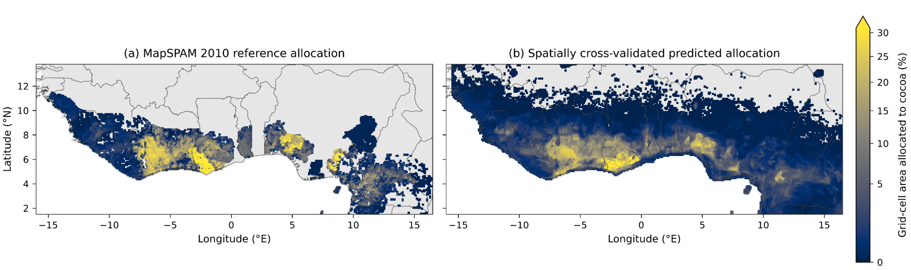
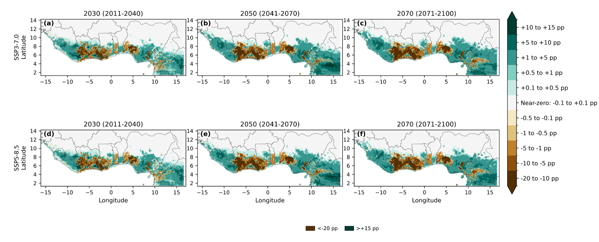
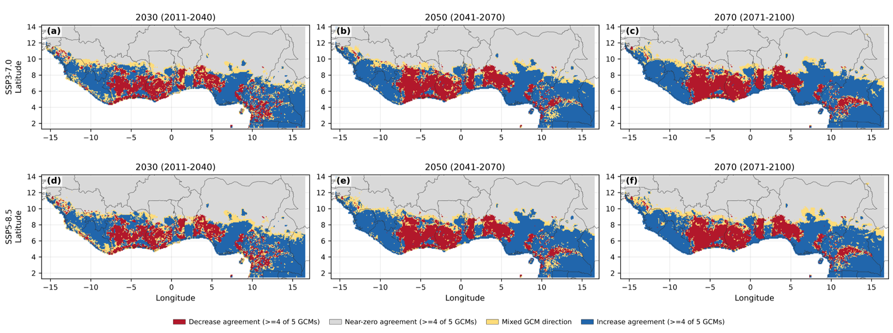
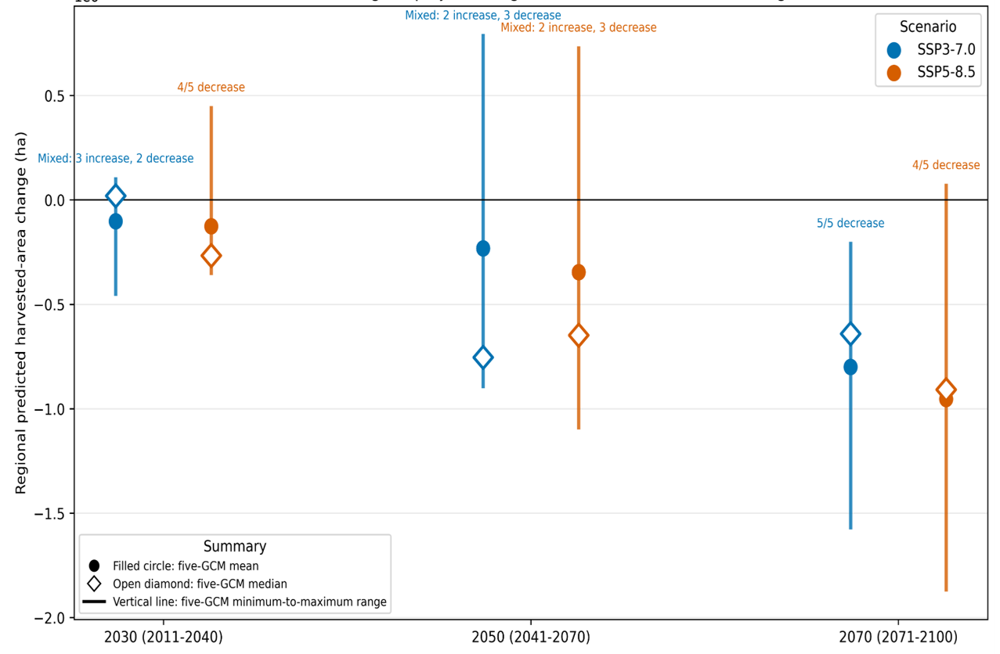
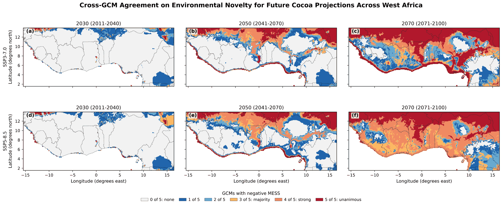

Cocoa and arabica coffee are two of West Africa's most climate-sensitive export crops, and both are grown largely within a relatively narrow range of temperature and rainfall conditions. This post shares an unpublished analysis I carried out to model how the climate-correlated spatial allocation of these crops may change across the region by 2030 (2011 - 2040), 2050 (2041 - 2070) , and 2070 (2071 -2100). Although the work was never submitted for publication, the methods, validation, and results are documented here as a record of the analysis and the scientific workflow behind it.

## Aim

To model the climate-correlated spatial distribution of cocoa and arabica coffee harvested-area allocation across West Africa and evaluate projected changes, inter-GCM agreement, and regional uncertainty under two future climate scenarios (SSP3-7.0 and SSP5-8.5).

## Data and methods

- **Allocation data:** [MapSPAM](https://www.mapspam.info/) 2010 global gridded harvested-area allocation data from the Spatial Production Allocation Model (SPAM), providing crop-specific harvested-area estimates at approximately 10 km spatial resolution.

- **Historical climate predictors:** [CHELSA](https://chelsa-climate.org/) V2.1 climatology. Climate data for the 1981–2010 reference period, available at 30 arc-second (~1 km) resolution and aggregated to the SPAM grid for modeling.

- **Future climate predictors:** CHELSA-downscaled CMIP6 projections from five GCMs under SSP3-7.0 and SSP5-8.5, spanning 2015–2100.

- **Topography:** WorldClim 2.1 elevation.

- **Predictors:** Eleven bioclimatic variables describing temperature and precipitation means, seasonality, and extremes, together with elevation.

- **Model:** A two-part hurdle Random Forest. Harvested-area fraction contains many zero values and a smaller number of skewed positive values, making a single regression model poorly suited to represent both processes. The first component (classifier) estimates the probability that a grid cell contains any allocation. The second component (regressor) estimates the harvested-area fraction where allocation is present. Multiplying these components yields the expected harvested-area fraction.

- **Validation:** Spatial block cross-validation using 1° geographic blocks. The study region was divided into geographic blocks, each withheld in turn and predicted using models trained on the remaining blocks. This provides a more realistic assessment of spatial transferability than random cross-validation because predictions are evaluated in locations not used for model training.

- **Uncertainty:** Projected changes were evaluated across five GCMs and summarized using the ensemble mean, median, and full range. Directional agreement was also quantified as the number of GCMs agreeing on the sign of change in each grid cell.

## Historical validation

::: {#fig-historical}

MapSPAM 2010 reference allocation (left) alongside the model's spatially cross-validated out-of-fold prediction (right).
:::

The model reproduces the broad cocoa-allocation belt across West Africa, though the predicted distribution is smoother and geographically more extensive than the MapSPAM reference. This is expected for a climate-correlated model: it captures where climate conditions resemble those found in existing cocoa-growing areas, rather than the finer-scale effects of land tenure, market access, infrastructure, policy, or historical land-use decisions that influence actual crop allocation.

The predictions therefore represent climate-correlated patterns in current harvested-area allocation rather than direct estimates of ecological suitability.

## Projected change

::: {#fig-change}

Projected percentage-point change in cocoa allocation for 2030, 2050, and 2070 under SSP3-7.0 (top row) and SSP5-8.5 (bottom row), relative to the matched historical prediction.
:::

Projected changes are spatially heterogeneous rather than uniform. Many grid cells show relatively small increases, but substantial declines are concentrated within parts of the current cocoa-allocation belt itself. These declines become more pronounced toward the end of the century under both climate scenarios.

Changes are expressed in percentage points rather than relative percentages because harvested-area allocation is itself a percentage of the grid cell. Percentage-point differences provide a direct and interpretable measure of absolute changes in allocated area.

## Where the climate models agree

::: {#fig-agreement}

Agreement among the five GCMs on the direction of projected cocoa allocation change. At least four of five models agreeing is considered strong agreement.
:::

Most locations show strong agreement on either near-zero change or an increase. Agreement on decreases is more geographically concentrated within specific portions of the historical cocoa belt, while areas with mixed signals among the five models remain comparatively limited.

Agreement describes how consistently the climate models indicate the same direction of change. It should not be interpreted as a probability or confidence interval for the projected outcome itself.

## Regional uncertainty

::: {#fig-uncertainty}

Five-GCM range in regionally aggregated cocoa harvested-area change (hectares), by scenario and period. Filled circles show the five-GCM mean, open diamonds the median, and vertical lines the full minimum-to-maximum range.
:::

Regional cocoa change remains genuinely uncertain through 2050, with individual GCMs differing on whether the overall effect is a regional gain or loss. By 2070, however, that uncertainty narrows in one direction: all five GCMs project a regional loss under SSP3-7.0, and four of five project a loss under SSP5-8.5.

These results suggest increasing consistency among climate models regarding the regional direction of change later in the century, even though the magnitude of that change remains uncertain.

## How far outside known conditions are we asking the model to predict?

::: {#fig-mess}

Cross-GCM agreement on environmental novelty for future cocoa projections, measured using the Multivariate Environmental Similarity Surface (MESS) diagnostic, shown here for 2070 under SSP5-8.5.
:::

A model trained on historical climate conditions can still produce predictions when presented with a future climate it has never experienced. However, those predictions warrant greater caution as projected conditions move further away from the climatic range used during model training.

The MESS diagnostic evaluates exactly this issue. For each grid cell and each GCM, it determines whether projected future climate conditions fall outside the range of historical predictor values available during model training. Negative MESS values indicate environmental novelty and therefore model extrapolation.

By 2070 under SSP5-8.5, much of West Africa is projected to experience climate conditions that are unfamiliar to the historical cocoa-allocation model. More than three-fifths of grid cells show strong agreement among the five GCMs that at least some climatic conditions fall outside the historical range, while nearly one-third show unanimous agreement across all five models.

This does not invalidate the projections in those locations. Rather, it highlights where future predictions rely increasingly on analogies to environmental conditions that were absent from the training data. Consequently, late-century projections should be interpreted with greater caution than projections occurring within well-represented portions of climate space.

## Why this matters

Cocoa supports the livelihoods of millions of smallholder farmers across Côte d'Ivoire, Ghana, and neighboring countries, and West Africa supplies roughly two-thirds of global cocoa production. Understanding where climate conditions may become more or less associated with current production patterns is therefore important for adaptation planning, agricultural investment, extension services, and long-term livelihood resilience.

Beyond the specific findings, this project demonstrates an end-to-end climate impact assessment workflow: integrating gridded agricultural data, downscaled climate projections, machine-learning models, spatial validation strategies, multi-model uncertainty analysis, and environmental novelty diagnostics. Together, these approaches provide a transparent framework for assessing both projected change and the confidence that can reasonably be placed in those projections.

*Methods, data, and results described here are unpublished. If you would like to discuss the analysis, methods, or broader workflow in more detail, feel free to get in touch.*

